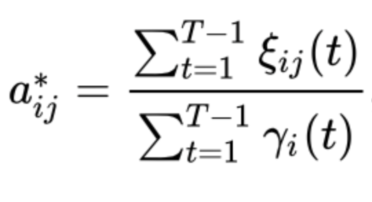

# Baum-Welch
Implementation of the Baum-Welch algorithm, to determine an approximation for the transition matrix, emmision matrix and starting probabilities of a Hidden Markov Model.

The algorithm begins by initialising a state transition probability matrix, an emission probability matrix, and the initial probability matrix. The state transition probability matrix is a 2-dimensional list of size ```[number of states]*[number of states]```, where index ```[i][j]``` denotes the probability of transitioning from state ```i``` to ```j```. The probabilities in this matrix are initially generated randomly. The emission probability matrix is a list of dictionaries, where index ```[i]``` denotes the emission probabilities for state ```i```. The dictionary keys are the letters from the alphabet and their associated values denote the probability of that letter (in the given state). The probabilities are initially set equally across all letters. The initial probability matrix is a list of size ```[number of states]```, where ```index[i]``` denotes the probability of starting in state ```i```.

Once these matrices have been initialised, the algorithm will then iterate through the main loop a certain number of times - equal to the number of iterations that was given as input parameter to the algorithm. On each iteration, it will aim to use the current parameters (i.e. the current state transition probability matrix, emission probability matrix and initial probability matrix) in order to generate a new set of parameters. This new set of parameters is then used as the input parameters for the next iteration, and so on and so forth. After the final iteration, the algorithm outputs the latest set of parameters.

The main loop aims to generate a new set of parameters. It does this by iterating through each of the observation sequences that were given as input to the algorithm. On each iteration, it uses the current parameters in conjunction with the given observation sequence to establish some variables. The forward procedure is undertaken to create ```alpha```, a matrix that stores the probabilities of seeing the observations until time ```t```, and being in state ```i``` at time ```t```. The backward procedure is undertaken to create ```beta```, a matrix that stores the probabilities of seeing the final ```t``` observations, and being in state ```i``` at time ```t```. Once ```alpha``` and ```beta``` are created, they are used to create two more variables: ```gamma```, a matrix which stores the probabilities of being in state ```i``` at time ```t``` given the observed sequence, and ```epsilon```, a matrix which stores the probabilities of being in states ```i``` and ```j``` at times ```t``` and ```t+1``` respectively given the observed sequence. 

```Gamma``` and ```epsilon``` are used to establish the new set of parameters. However, recall that the main loop performs everything described above per iteration whilst it iterates through all the observation sequences. This is to ensure that information from all the observed sequences are used to establish the new set of parameters. To clarify how it does this, take the traditional formula for the new state transition probability matrix:



This is the expected number of transitions from state ```i``` to state ```j``` over the expected total number of transitions away from state ```i```. The algorithm will keep track of two ‘global’ variables which track the cumulative sum of the numerator and denominator here across all observation sequences, and then carry out the division at the end after having iterated through all the observations to establish the new state transition probability matrix. Similar logic is used to establish the other parameters too.

The algorithm scales ```alpha``` and ```beta``` after creating them, and then uses the scaled values in subsequent calculations. This is because, by definition, all terms in ```alpha``` and ```beta``` are significantly less than 1. Thus, their respective summations (which are required in subsequent calculations) would exponentially tend to zero as ```t``` gets sufficiently large, to the extent that the precision of the computation of the variables would exceed the capability of computer processors. The scaling procedure used sees the values of ```alpha``` multiplied by a scaling coefficient which is independent of ```i```. The same scaling coefficient is applied to ```beta``` too, so at the end of the computation, the scaling coefficients cancel each other out. 

The Python Decimal module data type is used to store all values, ensuring that they can be stored exactly. Since this data type supports very large value precision, it means that the algorithm is capable of storing and carrying out accurate operations with extremely small/large numbers. This tends to be important when the input sequences are very long which causes some probabilities to get very small.

The primary method by which I validated the output of the algorithm was via the use of the ```hmmlearn``` Python package (https://github.com/hmmlearn/hmmlearn). This provides algorithms and models to learn HMMs. Given its commercial availability, it is reasonable to trust the output of its algorithms. Thus, I was able to initialise a model that performs the Baum-Welch algorithm with the line:

```model = hmm.MultinomialHMM(n_components=n, n_iter=num_iterations, init_params="", params="te", tol=0, implementation='scaling')```

I then passed in the exact same randomly generated initial parameters and observation sequences to the model and let it fit on this data. Note I emulated the algorithm’s characteristics in the model too - e.g. used the same number of iterations, implemented scaling on ```alpha``` and ```beta``` etc. I found that the algorithm’s output, across a range of different inputs, was effectively the same as the output of this model. Thus, this provides a strong validation of my implementation.

To further validate my implementation, I checked that the log-likelihood monotonically increases on each iteration of the algorithm - and this was indeed the case. I also checked that the values inside ```gamma``` and ```epsilon``` were correct. I firstly checked that the sum of all the ```gamma``` values across all states for any given timestep was always equal to 1. I also verified the relationship between ```gamma``` and ```epsilon``` - i.e. that the ```gamma``` value for a given timestep ```t``` and state ```i``` is always equal to the sum of the ```epsilon``` values at timestep ```t```, state ```i```, state ```j``` for all values of ```j```.

